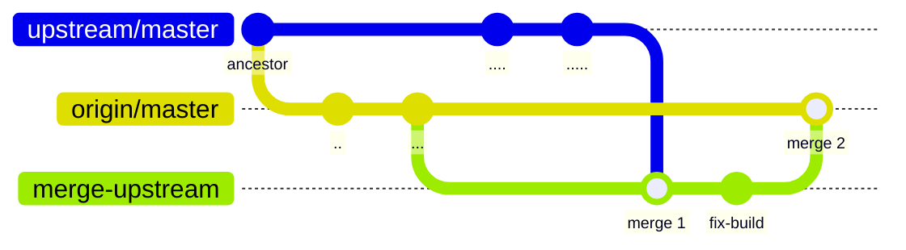

# Keeping aws-vault maintained

August 2025: we decided to fork [99designs's aws-vault tool](https://github.com/99designs/aws-vault) as it appears to have been abandoned by its creators and we still use this tool for day-to-day operation in PCI team, to manager short-term AWS credentials.

There also appears to be an active (at the time of writing, at least) [fork](https://github.com/ByteNess/aws-vault) of the project, receiving bugfixes and minor updates. This increases our chances of keeping `aws-vault` "alive" and preventing it from [rotting away](https://permacomputing.net/software_rot/).

Since `ByteNess/aws-vault` seems to be the only active fork currently, we'll start by keeping our copy synchronised with theirs. If it becomes apparent that they are also abandoning the project, we'll have to re-evaluate our options.

## Synchronising with an upstream fork

Current `upstream` fork: [ByteNess/aws-vault](https://github.com/ByteNess/aws-vault).

For now we only consider synchronising from the `upstream` fork to our Pix4D fork situation.

### From `upstream` to our fork

When cloning this repository, it will only contain one remote, named `origin` which points to itself (Pix4D/aws-vault` in GitHub).

```
$ git remote -v
origin	git@github.com:pix4d/aws-vault (fetch)
origin	git@github.com:pix4d/aws-vault (push)
```

We need to add the `upstream` remote. This information cannot be pushed to GitHub:

```
$ git remote add upstream https://github.com/byteness/aws-vault.git

$ git remote -v
origin	git@github.com:pix4d/aws-vault (fetch)
origin	git@github.com:pix4d/aws-vault (push)
upstream	https://github.com/byteness/aws-vault.git (fetch)
upstream	https://github.com/byteness/aws-vault.git (push)
```

**NOTES**

- The names `origin` and `upstream` and purely conventions, they are opque to `git`. GitHub knows about `origin`.
- Forking can be confusing, since the `origin` remote is changed by GitHub.

Now that we added the `upstream` remote, we have 3 `master` branches:

- `master`: the local branch. Normally it is set to **track** the `origin/master` branch.
- `origin/master`: the remote branch on `origin` (that is, our fork).
- `upstream/master`: the remote branch on `upstream`.

#### Procedure to synchronise from an upstream branch

We'll demonstrate the procedure using `<branch>` as the upstream branch. You should replace it by `master`, `main` or anything suitable such as a feature branch.

1. Ensure the local master is up to date.
    ```
    git fetch origin master
    git rebase origin/master master
    ```
2. Fetch changes from the upstream branch.
    ```
    git fetch upstream <branch>
    ```
3. Do not push `upstream/<branch>` to `origin`. Let is stay a local branch.
4. Create merge branch.
    ```
    git checkout -b merge-upstream-<branch>
    ```
5. Merge `upstream/<branch>` into the local branch `merge-upstream-<branch>`.
    - This might generate merge conflicts. Take your time to resolve them.
    - If overwhelmed, you can make multiple merges of `upstream/<branch>`. Instead of merging directly from the HEAD commit, chose a merge-base from an arbitrary PR in the past and repeat until you reach HEAD.
    - Feel free to ask for help in the PCI team chat. We want to avoid **merge damages**.
    ```
    git merge upstream/<branch>
    ```
6. The merge command will also commit the merge (as soon as all the conflicts are resolved).
    - If needed, do one or more commits to make the code compile and pass all the tests.
    - This allows the reviewers to better understand what is happening.
7. Open a PR in GitHub as usual, merge when approved.

Visually (using `master` as `upstream` branch):


